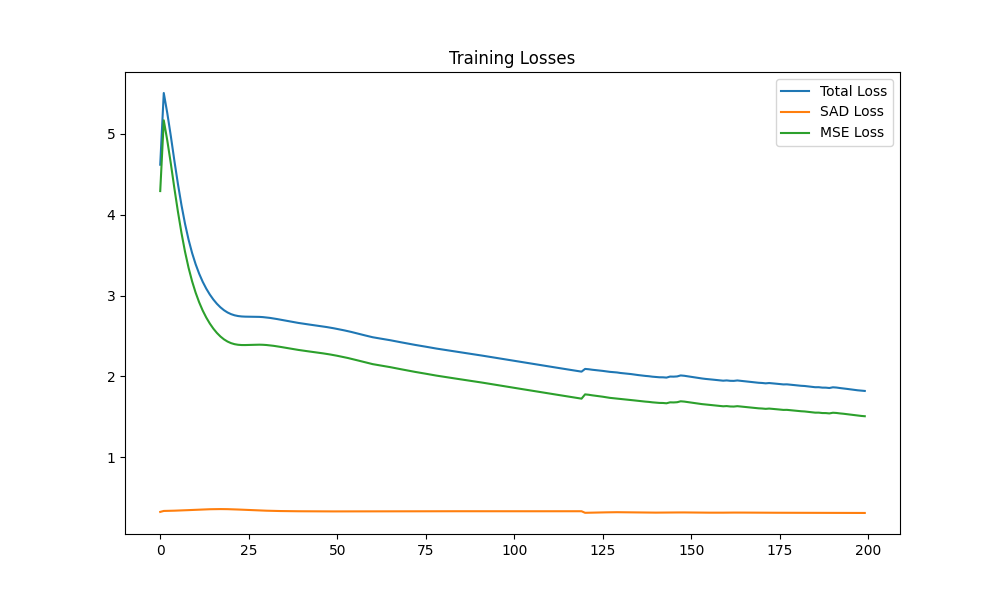
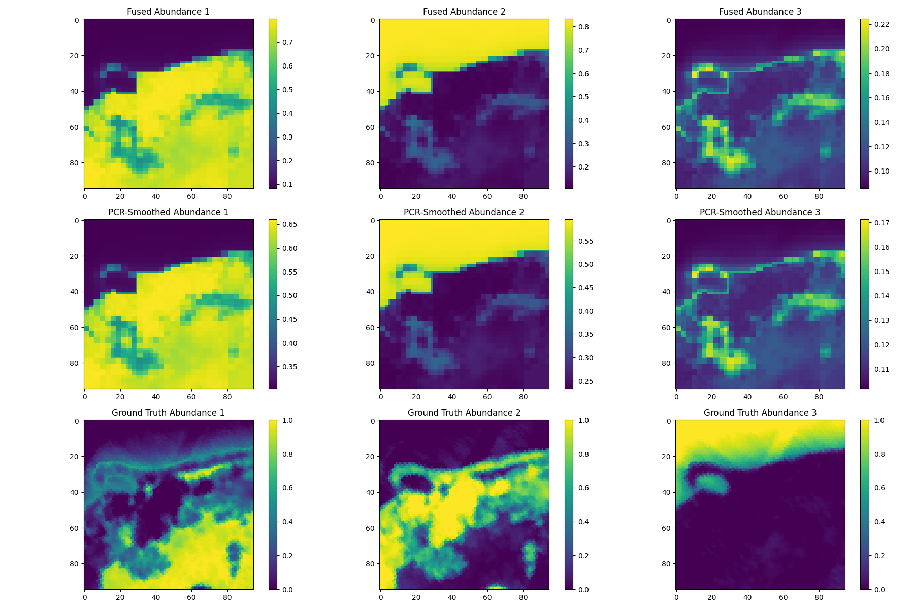
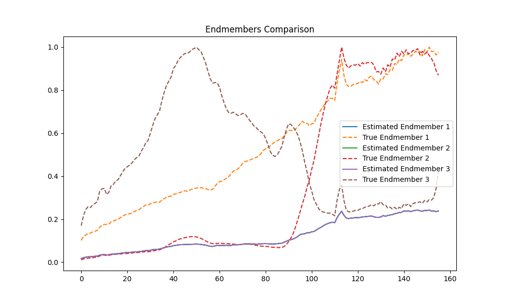
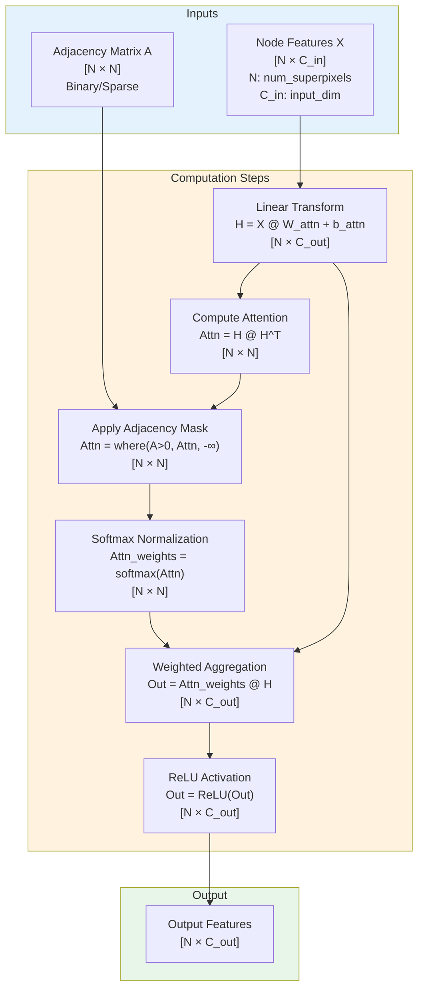
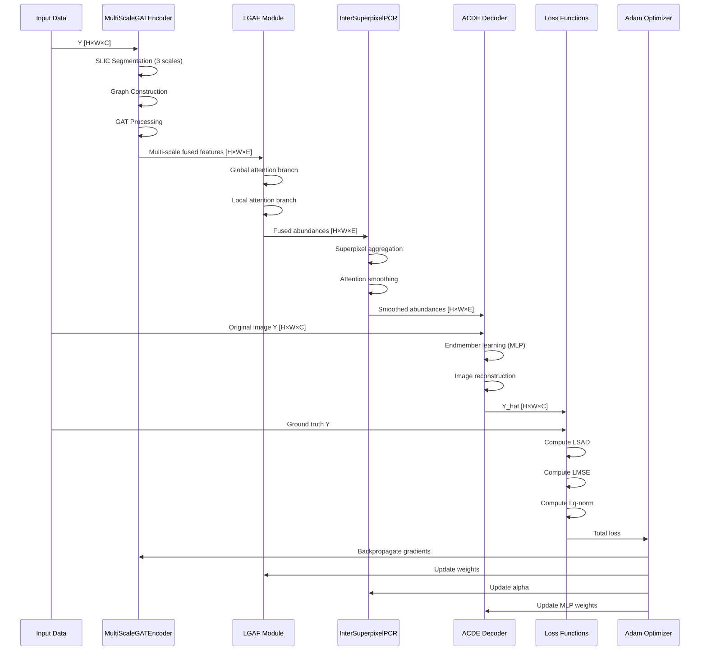

# Hyperspectral Unmixing with Multi-Scale GAT and Inter-Superpixel PCR

This repository implements a hyperspectral unmixing model using Multi-Scale Graph Attention Networks (GAT) and Inter-Superpixel PCR (Principal Component Regression) for abundance estimation.

## Features

- **Multi-Scale GAT Encoder**: Extracts features at multiple superpixel scales (2000, 1000, 500)
- **LGAF (Local-Global Attention Fusion)**: Fuses global and local features
- **Inter-Superpixel PCR**: Smooths abundance maps using superpixel relationships
- **ACDE (Adaptive Class-Dependent Endmember)**: Learns endmembers adaptively

## Requirements

```bash
pip install tensorflow numpy scikit-image scikit-learn scipy matplotlib networkx spektral
```

Or use the virtual environment:
```bash
python3 -m venv venv
source venv/bin/activate  # On Windows: venv\Scripts\activate
pip install -r requirements.txt
```

## Data

Place your `.mat` files in the `data/` directory:
- `samson.mat`: Hyperspectral image data
- `end3.mat`: Ground truth endmembers and abundances

## Usage

```bash
python hyperspectral_unmixing.py
```

## Output

Results are saved in the `results/` directory:

### Training Losses

*Training loss curves showing Total Loss, SAD (Spectral Angle Distance), and MSE (Mean Squared Error) over 200 epochs*

### Abundance Maps Comparison

*Comparison of abundance maps: Fused (top row), PCR-smoothed (middle row), and Ground Truth (bottom row) for each endmember*

### Endmembers Comparison

*Comparison of estimated endmembers (solid lines) vs ground truth endmembers (dashed lines) across all 156 spectral bands*

## Model Architecture

### Data Flow and Dimensions

The model processes hyperspectral images with the following dimensions:
- **Input Image**: `Y [H × W × C]` where H=95, W=95, C=156 (Samson dataset)
- **Endmembers**: `M [E × C]` where E=3 (number of endmembers)
- **Abundances**: `S [H × W × E]` (abundance maps for each endmember)

### Complete Architecture Flow

```mermaid
graph TB
    subgraph Input["Input Layer"]
        Y["Hyperspectral Image Y<br/>[H × W × C]<br/>C=156 bands"]
    end
    
    subgraph Encoder["MultiScaleGATEncoder"]
        direction TB
        Y --> SLIC1["SLIC Segmentation<br/>Scale 1: 2000 superpixels"]
        Y --> SLIC2["SLIC Segmentation<br/>Scale 2: 1000 superpixels"]
        Y --> SLIC3["SLIC Segmentation<br/>Scale 3: 500 superpixels"]
        
        SLIC1 --> Graph1["Graph Construction<br/>- Spatial Adjacency<br/>- Cosine Similarity<br/>- Top-K Neighbors"]
        SLIC2 --> Graph2["Graph Construction<br/>- Spatial Adjacency<br/>- Cosine Similarity<br/>- Top-K Neighbors"]
        SLIC3 --> Graph3["Graph Construction<br/>- Spatial Adjacency<br/>- Cosine Similarity<br/>- Top-K Neighbors"]
        
        Graph1 --> GAT1["GAT Layer 1<br/>Input: 156 → 64<br/>CustomGATConv"]
        Graph2 --> GAT2["GAT Layer 1<br/>Input: 156 → 64<br/>CustomGATConv"]
        Graph3 --> GAT3["GAT Layer 1<br/>Input: 156 → 64<br/>CustomGATConv"]
        
        GAT1 --> GAT1_2["GAT Layer 2<br/>64 → E<br/>E=num_endmembers"]
        GAT2 --> GAT2_2["GAT Layer 2<br/>64 → E<br/>E=num_endmembers"]
        GAT3 --> GAT3_2["GAT Layer 2<br/>64 → E<br/>E=num_endmembers"]
        
        GAT1_2 --> ReLU1["ReLU + Softmax"]
        GAT2_2 --> ReLU2["ReLU + Softmax"]
        GAT3_2 --> ReLU3["ReLU + Softmax"]
        
        ReLU1 --> Map1["Map to Pixels<br/>tf.gather<br/>[H × W × E]"]
        ReLU2 --> Map2["Map to Pixels<br/>tf.gather<br/>[H × W × E]"]
        ReLU3 --> Map3["Map to Pixels<br/>tf.gather<br/>[H × W × E]"]
        
        Map1 --> Stack["Stack Multi-Scale<br/>[3 × H × W × E]"]
        Map2 --> Stack
        Map3 --> Stack
        
        Stack --> Weight["Learnable Scale Weights<br/>Softmax Normalization<br/>[3]"]
        Weight --> Fusion["Weighted Fusion<br/>Weighted Sum<br/>[H × W × E]"]
    end
    
    subgraph LGAF_Module["LGAF: Local-Global Attention Fusion"]
        direction TB
        Fusion --> SG["SG: Global Features<br/>[H × W × E]"]
        Fusion --> SC["SC: Local Features<br/>[H × W × E]"]
        
        SG --> Concat1["Concatenate<br/>[1 × H × W × 2E]"]
        SC --> Concat1
        
        Concat1 --> GlobalConv["Global Conv2D<br/>1×1, Sigmoid<br/>[1 × H × W × E]"]
        GlobalConv --> FG["FG: Global Attention<br/>[H × W × E]"]
        
        FG --> SC_Hat["SC_hat = α·FG·SG + SC<br/>α: Learnable"]
        SC --> SC_Hat
        
        SC --> Concat2["Concatenate<br/>[1 × H × W × 2E]"]
        SG --> Concat2
        
        Concat2 --> LocalConv["Local Conv2D<br/>1×1, Sigmoid<br/>[1 × H × W × E]"]
        LocalConv --> FC["FC: Local Attention<br/>[H × W × E]"]
        
        FC --> SG_Hat["SG_hat = β·FC·SC + SG<br/>β: Learnable"]
        SG --> SG_Hat
        
        SC_Hat --> FinalFusion["Final Fusion<br/>Softmax(SG_hat + SC_hat)<br/>[H × W × E]"]
        SG_Hat --> FinalFusion
    end
    
    subgraph PCR["InterSuperpixelPCR"]
        direction TB
        FinalFusion --> SegmentMean["Superpixel Aggregation<br/>unsorted_segment_mean<br/>[N_superpixels × E]"]
        
        SegmentMean --> Attention["Attention Matrix<br/>Softmax Normalization<br/>[N_superpixels × N_superpixels]"]
        
        Attention --> Smooth["Smooth Features<br/>Matrix Multiplication<br/>[N_superpixels × E]"]
        
        Smooth --> Gather["Gather to Pixels<br/>tf.gather<br/>[H × W × E]"]
        
        Gather --> Alpha["Alpha Blending<br/>α·Smoothed + (1-α)·Original<br/>α: Learnable"]
        FinalFusion --> Alpha
    end
    
    subgraph Decoder["ACDE: Adaptive Class-Dependent Endmember"]
        direction TB
        Alpha --> S_Flat["Flatten Abundances<br/>[H·W × E]"]
        Y --> Y_Flat["Flatten Image<br/>[H·W × C]"]
        
        S_Flat --> ArgMax["Class Indices<br/>argmax(S_flat)<br/>[H·W]"]
        
        ArgMax --> Mask["Class Masks<br/>For each endmember p"]
        Y_Flat --> Mask
        
        Mask --> MLP["MLP Network<br/>Dense(128) → Dense(128) → Dense(C)<br/>Weight Learning"]
        
        MLP --> WeightedSum["Weighted Sum<br/>Σ(w_i · pixel_i)<br/>[C]"]
        
        WeightedSum --> Endmembers["Endmembers M<br/>Stack: [E × C]"]
        
        S_Flat --> MatMul["Matrix Multiplication<br/>S_flat @ M<br/>[H·W × C]"]
        Endmembers --> MatMul
        
        MatMul --> Y_Hat["Reconstructed Image<br/>[H × W × C]"]
    end
    
    subgraph Loss["Loss Computation"]
        direction TB
        Y_Hat --> LSAD["LSAD Loss<br/>Spectral Angle Distance<br/>Mean of arccos(cosine_sim)"]
        Y_Flat --> LSAD
        
        Y_Hat --> LMSE["LMSE Loss<br/>Mean Squared Error<br/>Mean(||Y - Y_hat||²)"]
        Y_Flat --> LMSE
        
        S_Flat --> LQ["Lq-Norm Sparsity<br/>Mean(|S|^q)<br/>q=0.5"]
        
        LSAD --> TotalLoss["Total Loss<br/>LSAD + λ₁·LMSE + λ₂·Lq<br/>λ₁=1.0, λ₂=0.001"]
        LMSE --> TotalLoss
        LQ --> TotalLoss
    end
    
    TotalLoss --> Backprop["Backpropagation<br/>Adam Optimizer<br/>lr=0.001"]
    Backprop --> Encoder
    Backprop --> LGAF_Module
    Backprop --> PCR
    Backprop --> Decoder
    
    style Y fill:#e1f5ff
    style Encoder fill:#fff4e1
    style LGAF_Module fill:#e8f5e9
    style PCR fill:#f3e5f5
    style Decoder fill:#fce4ec
    style Loss fill:#ffebee
```



### Component Details

#### 1. MultiScaleGATEncoder
- **Input**: Hyperspectral image `Y [H × W × C]`
- **Process**:
  1. **SLIC Segmentation**: Creates superpixels at 3 scales (2000, 1000, 500)
  2. **Graph Construction**: 
     - Computes superpixel features (mean of pixels in each superpixel)
     - Builds spatial adjacency matrix (horizontal + vertical edges)
     - Adds top-K cosine similarity edges for each superpixel
  3. **GAT Processing**: 
     - Two-layer GAT: `156 → 64 → E` (E = num_endmembers)
     - Custom attention mechanism with adjacency masking
  4. **Multi-Scale Fusion**: 
     - Maps superpixel features back to pixel space using `tf.gather`
     - Learns scale weights and performs weighted fusion

#### 2. LGAF (Local-Global Attention Fusion)
- **Input**: Fused multi-scale features `[H × W × E]`
- **Process**:
  1. **Global Branch**: 
     - Concatenates SG and SC → Conv2D(1×1) → Sigmoid → FG
     - Computes: `SC_hat = α·FG·SG + SC`
  2. **Local Branch**: 
     - Concatenates SC and SG → Conv2D(1×1) → Sigmoid → FC
     - Computes: `SG_hat = β·FC·SC + SG`
  3. **Final Fusion**: `Softmax(SG_hat + SC_hat)`
- **Learnable Parameters**: α, β (trainable scalars)

#### 3. InterSuperpixelPCR
- **Input**: Fused abundances `[H × W × E]`
- **Process**:
  1. **Superpixel Aggregation**: Computes mean features per superpixel
  2. **Attention Smoothing**: Applies attention-weighted smoothing across superpixels
  3. **Alpha Blending**: `α·Smoothed + (1-α)·Original`
- **Purpose**: Reduces noise and enforces spatial consistency

#### 4. ACDE (Adaptive Class-Dependent Endmember)
- **Input**: 
  - Abundances `S [H·W × E]`
  - Image `Y [H·W × C]`
- **Process**:
  1. **Class Assignment**: `argmax(S)` to assign each pixel to an endmember class
  2. **Endmember Learning**: 
     - For each endmember class p:
       - Extract pixels belonging to class p
       - Pass through MLP to learn weights
       - Compute weighted sum: `M_p = Σ(w_i · pixel_i)`
  3. **Reconstruction**: `Y_hat = S @ M`
- **Output**: Reconstructed image `Y_hat [H × W × C]`

#### 5. Loss Functions
- **LSAD (Spectral Angle Distance)**: Measures angular difference between spectra
- **LMSE (Mean Squared Error)**: Measures reconstruction error
- **Lq-Norm**: Sparsity constraint on abundance matrix (q=0.5)
- **Total Loss**: `L = LSAD + λ₁·LMSE + λ₂·Lq`

### CustomGATConv Layer

The custom Graph Attention layer implements attention mechanism with adjacency masking:



**Key Operations**:
1. **Linear Transformation**: Projects input features to output dimension
2. **Attention Computation**: Computes pairwise attention scores via dot product
3. **Adjacency Masking**: Only allows attention between connected nodes (A > 0)
4. **Softmax Normalization**: Normalizes attention weights
5. **Weighted Aggregation**: Combines neighbor features based on attention weights
6. **ReLU Activation**: Applies non-linearity

### Training Process



## Performance Optimizations

- GPU/CPU auto-configuration
- Mixed precision training (if GPU available)
- Vectorized operations for graph creation
- Optimized TensorFlow operations
- Gradient-preserving tensor operations (no numpy conversion in forward pass)

## Results Visualization

The model generates three types of visualizations to evaluate performance:

### 1. Training Losses
The training loss plot shows the convergence behavior of the model:
- **Total Loss**: Combined loss (LSAD + λ₁·LMSE + λ₂·Lq-norm)
- **SAD Loss**: Spectral Angle Distance - measures angular similarity between estimated and ground truth spectra
- **MSE Loss**: Mean Squared Error - measures reconstruction accuracy

A decreasing trend indicates successful learning. The model typically converges within 200 epochs.

### 2. Abundance Maps Comparison
This visualization compares three types of abundance maps for each endmember:
- **Fused Abundances** (top row): Direct output from MultiScaleGATEncoder after multi-scale fusion
- **PCR-Smoothed Abundances** (middle row): After InterSuperpixelPCR smoothing for spatial consistency
- **Ground Truth** (bottom row): Reference abundance maps from the dataset

The comparison helps assess:
- Spatial accuracy of endmember distribution
- Effectiveness of PCR smoothing
- Visual quality of the unmixing results

### 3. Endmembers Comparison
Spectral signature plots showing:
- **Estimated Endmembers** (solid lines): Learned endmember spectra by the ACDE module
- **Ground Truth Endmembers** (dashed lines): Reference endmember spectra from the dataset

Close alignment between estimated and ground truth curves indicates successful endmember learning. The plot shows spectral characteristics across all 156 bands.

