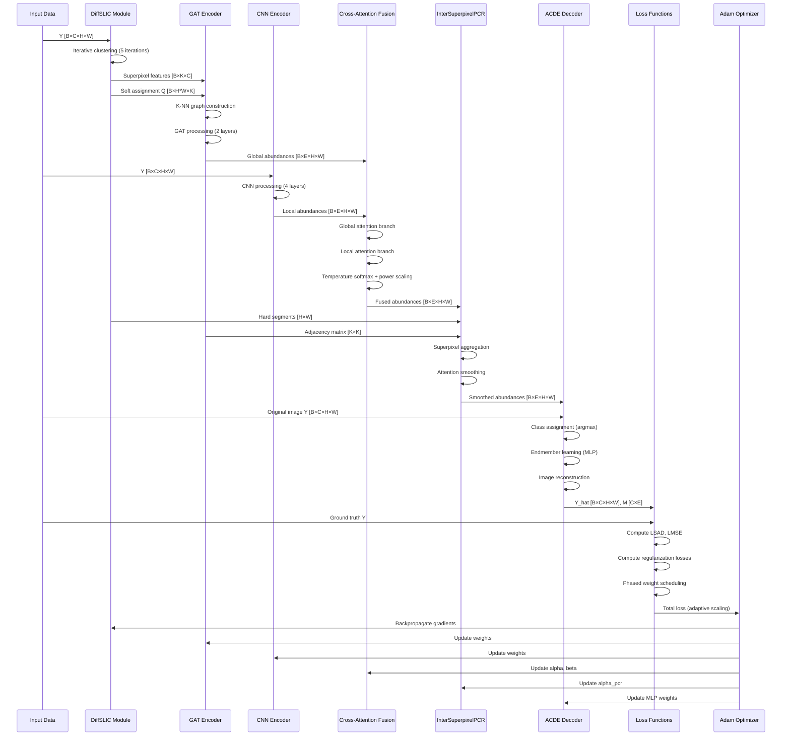

# Hyperspectral Unmixing with Multi-Scale GAT and Inter-Superpixel PCR

This repository implements a hyperspectral unmixing model using Graph Attention Networks (GAT) and Inter-Superpixel PCR (Principal Component Regression) for abundance estimation. The implementation is built with PyTorch.

## Features

- **DiffSLIC (Differentiable SLIC)**: Differentiable superpixel segmentation for end-to-end training
- **GAT Encoder**: Graph Attention Network for global feature extraction from superpixels
- **CNN Encoder**: Convolutional neural network for local feature extraction
- **Cross-Attention Fusion (LGAF)**: Fuses global and local features with learnable attention
- **Inter-Superpixel PCR**: Smooths abundance maps using superpixel relationships
- **ACDE (Adaptive Class-Dependent Endmember)**: Learns endmembers adaptively using MLP-based weighting
- **VCA Initialization**: Vertex Component Analysis for endmember initialization

## Requirements

```bash
pip install torch torchvision numpy scikit-image scikit-learn scipy matplotlib
```

Optional (for improved GAT performance):
```bash
pip install torch-geometric
```

Or use the virtual environment:
```bash
python3 -m venv venv
source venv/bin/activate  # On Windows: venv\Scripts\activate
pip install -r requirements.txt
```

## Data

Place your `.mat` files in the `data/` directory:
- `samson.mat`: Hyperspectral image data
- `end3.mat`: Ground truth endmembers and abundances

## Usage

```bash
python hsu.py
```

## Output

Results are saved in the `results/` directory:

### Training Losses

*Training loss curves showing Total Loss, SAD (Spectral Angle Distance), MSE (Mean Squared Error), and various regularization losses over 300 epochs*

### Abundance Maps Comparison

*Comparison of estimated abundance maps (top row) vs ground truth abundance maps (bottom row) for each endmember*

### Endmembers Comparison

*Comparison of estimated endmembers (solid lines) vs ground truth endmembers (dashed lines) across all 156 spectral bands*

## Model Architecture

### Data Flow and Dimensions

The model processes hyperspectral images with the following dimensions:
- **Input Image**: `Y [B × C × H × W]` where B=1 (batch), C=156 (bands), H=95, W=95 (Samson dataset)
- **Endmembers**: `M [C × E]` where E=3 (number of endmembers)
- **Abundances**: `S [B × E × H × W]` (abundance maps for each endmember)

### Complete Architecture Flow

```mermaid
graph TB
    subgraph Input["Input Layer"]
        Y["Hyperspectral Image Y<br/>[B × C × H × W]<br/>C=156 bands"]
    end
    
    subgraph DiffSLIC["DiffSLIC Module"]
        direction TB
        Y --> InitCenters["Initialize Centers<br/>Grid-based<br/>K=120 superpixels"]
        InitCenters --> Iterative["Iterative Clustering<br/>5 iterations<br/>Spectral + Spatial Distance"]
        Iterative --> Q["Soft Assignment Q<br/>[B × H*W × K]"]
        Iterative --> SuperFeats["Superpixel Features<br/>[B × K × C]"]
    end
    
    subgraph GATEncoder["GAT Encoder"]
        direction TB
        SuperFeats --> KNN["K-NN Graph Construction<br/>K=6 neighbors<br/>Spectral Angle Similarity"]
        KNN --> Adj["Adjacency Matrix<br/>[B × K × K]"]
        SuperFeats --> GAT1["GAT Layer 1<br/>C → 64<br/>Multi-head Attention"]
        Adj --> GAT1
        GAT1 --> GAT2["GAT Layer 2<br/>64 → E<br/>E=num_endmembers"]
        Adj --> GAT2
        GAT2 --> GlobalAbund["Global Abundances<br/>[B × K × E]"]
    end
    
    subgraph CNNEncoder["CNN Encoder"]
        direction TB
        Y --> Conv1["Conv2D 3×3<br/>C → 64<br/>InstanceNorm + ReLU"]
        Conv1 --> Conv2["Conv2D 3×3, dilation=2<br/>64 → 128<br/>InstanceNorm + ReLU"]
        Conv2 --> Conv3["Conv2D 3×3<br/>128 → 128<br/>InstanceNorm + ReLU"]
        Conv3 --> Conv4["Conv2D 1×1<br/>128 → E<br/>Local Abundances"]
        Conv4 --> LocalAbund["Local Abundances<br/>[B × E × H × W]"]
    end
    
    subgraph Mapping["Pixel Mapping"]
        direction TB
        Q --> Gather["Gather Operation<br/>Q @ GlobalAbund"]
        GlobalAbund --> Gather
        Gather --> GlobalPixel["Global Pixel Abundances<br/>[B × E × H × W]"]
    end
    
    subgraph LGAF_Module["Cross-Attention Fusion (LGAF)"]
        direction TB
        GlobalPixel --> SG["SG: Global Features<br/>[B × E × H × W]"]
        LocalAbund --> SC["SC: Local Features<br/>[B × E × H × W]"]
        
        SG --> Concat1["Concatenate<br/>[B × 2E × H × W]"]
        SC --> Concat1
        
        Concat1 --> GlobalConv["Conv2D 1×1<br/>2E → E, Sigmoid<br/>[B × E × H × W]"]
        GlobalConv --> FG["FG: Global Attention<br/>[B × E × H × W]"]
        
        FG --> SC_Hat["SC_hat = α·FG·SG + SC<br/>α: Learnable (1.5)"]
        SC --> SC_Hat
        
        SC --> Concat2["Concatenate<br/>[B × 2E × H × W]"]
        SG --> Concat2
        
        Concat2 --> LocalConv["Conv2D 1×1<br/>2E → E, Sigmoid<br/>[B × E × H × W]"]
        LocalConv --> FC["FC: Local Attention<br/>[B × E × H × W]"]
        
        FC --> SG_Hat["SG_hat = β·FC·SC + SG<br/>β: Learnable (0.3)"]
        SG --> SG_Hat
        
        SC_Hat --> TempSoftmax["Temperature Softmax<br/>T=0.3, Power=1.5<br/>Sharp Distribution"]
        SG_Hat --> TempSoftmax
        TempSoftmax --> FusedAbund["Fused Abundances<br/>[B × E × H × W]"]
    end
    
    subgraph PCR["InterSuperpixelPCR"]
        direction TB
        FusedAbund --> SegmentMean["Superpixel Aggregation<br/>Mean per superpixel<br/>[B × K × E]"]
        Q --> HardSeg["Hard Segmentation<br/>argmax(Q)<br/>[H × W]"]
        HardSeg --> SegmentMean
        
        SegmentMean --> Attention["Attention Matrix<br/>From Adjacency<br/>Softmax Normalization<br/>[K × K]"]
        Adj --> Attention
        
        Attention --> Smooth["Smooth Features<br/>Matrix Multiplication<br/>[B × K × E]"]
        SegmentMean --> Smooth
        
        Smooth --> GatherPCR["Gather to Pixels<br/>torch.gather<br/>[B × E × H × W]"]
        HardSeg --> GatherPCR
        
        GatherPCR --> Alpha["Alpha Blending<br/>α·Smoothed + (1-α)·Original<br/>α: Learnable (0.3)"]
        FusedAbund --> Alpha
        Alpha --> SmoothedAbund["Smoothed Abundances<br/>[B × E × H × W]"]
    end
    
    subgraph Decoder["ACDE: Adaptive Class-Dependent Endmember"]
        direction TB
        SmoothedAbund --> S_Flat["Flatten Abundances<br/>[B*H*W × E]"]
        Y --> Y_Flat["Flatten Image<br/>[B*H*W × C]"]
        
        S_Flat --> ArgMax["Class Indices<br/>argmax(S_flat)<br/>[B*H*W]"]
        
        ArgMax --> Mask["Class Masks<br/>For each endmember p"]
        Y_Flat --> Mask
        
        Mask --> MLP["MLP Network<br/>Linear(C→128) → ReLU<br/>Linear(128→128) → ReLU<br/>Linear(128→1)<br/>Weight Learning"]
        
        MLP --> SoftmaxWeights["Softmax Weights<br/>[num_pixels_p]"]
        Mask --> PixelSelect["Select Pixels<br/>[num_pixels_p × C]"]
        Y_Flat --> PixelSelect
        
        SoftmaxWeights --> WeightedSum["Weighted Sum<br/>Σ(w_i · pixel_i)<br/>[C]"]
        PixelSelect --> WeightedSum
        
        WeightedSum --> Adaptive["Adaptive Endmember<br/>0.5·Weighted + 0.5·Base<br/>[C]"]
        WeightedSum --> Endmembers["Endmembers M<br/>Stack: [C × E]"]
        Adaptive --> Endmembers
        
        S_Flat --> MatMul["Matrix Multiplication<br/>S_flat @ M^T<br/>[B*H*W × C]"]
        Endmembers --> MatMul
        
        MatMul --> Reshape["Reshape<br/>[B × C × H × W]"]
        Reshape --> Y_Hat["Reconstructed Image<br/>[B × C × H × W]"]
    end
    
    subgraph Loss["Loss Computation"]
        direction TB
        Y_Hat --> LSAD["LSAD Loss<br/>Spectral Angle Distance<br/>Mean of arccos(cosine_sim)"]
        Y --> LSAD
        
        Y_Hat --> LMSE["LMSE Loss<br/>Mean Squared Error<br/>Mean(||Y - Y_hat||²)"]
        Y --> LMSE
        
        SmoothedAbund --> LQ["Lq-Norm Sparsity<br/>Mean(|S|^0.5)<br/>q=0.5"]
        
        SmoothedAbund --> LBalance["Abundance Balance<br/>Encourage uniform mean<br/>per endmember"]
        
        SmoothedAbund --> LMax["Max Constraint<br/>Prevent collapse<br/>(mean < 0.5)"]
        
        SmoothedAbund --> LEntropy["Entropy Loss<br/>Encourage sparsity<br/>(low entropy)"]
        
        SmoothedAbund --> LPurity["Purity Reward<br/>Reward pure pixels<br/>(max > 0.8)"]
        
        Endmembers --> LOrtho["Orthogonality Loss<br/>Encourage orthogonal<br/>endmembers"]
        
        LSAD --> TotalLoss["Total Loss<br/>Phased Training Schedule<br/>Phase 1-4: Gradual ramp-up"]
        LMSE --> TotalLoss
        LQ --> TotalLoss
        LBalance --> TotalLoss
        LMax --> TotalLoss
        LEntropy --> TotalLoss
        LPurity --> TotalLoss
        LOrtho --> TotalLoss
    end
    
    TotalLoss --> Backprop["Backpropagation<br/>Adam Optimizer<br/>lr=1e-3<br/>ReduceLROnPlateau"]
    Backprop --> DiffSLIC
    Backprop --> GATEncoder
    Backprop --> CNNEncoder
    Backprop --> LGAF_Module
    Backprop --> PCR
    Backprop --> Decoder
    
    style Y fill:#e1f5ff
    style Encoder fill:#fff4e1
    style LGAF_Module fill:#e8f5e9
    style PCR fill:#f3e5f5
    style Decoder fill:#fce4ec
    style Loss fill:#ffebee
```



### Component Details

#### 1. DiffSLIC (Differentiable SLIC)
- **Input**: Hyperspectral image `Y [B × C × H × W]`
- **Process**:
  1. **Center Initialization**: Grid-based initialization of superpixel centers (K=120)
  2. **Iterative Clustering**: 5 iterations of:
     - Compute spectral distance (Euclidean) between pixels and centers
     - Compute spatial distance (Euclidean) between pixel coordinates and center coordinates
     - Combined distance: `D = d_spectral + (compactness/S) * d_spatial`
     - Soft assignment: `Q = softmax(-D)` (differentiable)
     - Update centers using weighted average
  3. **Output**: 
     - Soft assignment matrix `Q [B × H*W × K]`
     - Superpixel features `[B × K × C]` (weighted average of pixels)

#### 2. GAT Encoder
- **Input**: Superpixel features `[B × K × C]`
- **Process**:
  1. **Graph Construction**: 
     - Builds K-NN graph (K=6) using Spectral Angle Similarity (SAM)
     - Computes cosine similarity between superpixel features
     - Creates adjacency matrix with top-K neighbors
  2. **GAT Processing**: 
     - Two-layer GAT: `C → 64 → E` (E = num_endmembers)
     - Uses PyTorch Geometric GATConv if available, otherwise SimpleGATLayer fallback
     - Multi-head attention (4 heads in first layer)
     - Adjacency masking for attention computation
  3. **Pixel Mapping**: 
     - Maps superpixel abundances to pixels using soft assignment: `Q @ GlobalAbund`
     - Applies temperature softmax (T=0.3) and power scaling (1.5) for sharp distributions

#### 3. CNN Encoder
- **Input**: Hyperspectral image `Y [B × C × H × W]`
- **Architecture**:
  - Conv2D(3×3, C→64) + InstanceNorm + ReLU
  - Conv2D(3×3, dilation=2, 64→128) + InstanceNorm + ReLU
  - Conv2D(3×3, 128→128) + InstanceNorm + ReLU
  - Conv2D(1×1, 128→E) → Local abundances
- **Output**: Local abundance maps `[B × E × H × W]`

#### 4. Cross-Attention Fusion (LGAF)
- **Input**: 
  - Global abundances `SG [B × E × H × W]`
  - Local abundances `SC [B × E × H × W]`
- **Process**:
  1. **Global Branch**: 
     - Concatenates SG and SC → Conv2D(1×1) → Sigmoid → FG
     - Computes: `SC_hat = α·FG·SG + SC` (α = 1.5, learnable)
  2. **Local Branch**: 
     - Concatenates SC and SG → Conv2D(1×1) → Sigmoid → FC
     - Computes: `SG_hat = β·FC·SC + SG` (β = 0.3, learnable)
  3. **Final Fusion**: 
     - Temperature softmax: `Softmax((SG_hat + SC_hat) / 0.3)`
     - Power scaling: `S^(1/1.5)` for sharper distributions
     - Renormalize to ensure sum-to-one constraint
- **Learnable Parameters**: α, β (trainable scalars)

#### 5. InterSuperpixelPCR
- **Input**: Fused abundances `[B × E × H × W]`
- **Process**:
  1. **Hard Segmentation**: Converts soft assignment Q to hard segments using `argmax`
  2. **Superpixel Aggregation**: Computes mean abundance features per superpixel `[B × K × E]`
  3. **Attention Smoothing**: 
     - Uses adjacency matrix from GAT encoder as attention weights
     - Applies softmax normalization
     - Smooths features: `Smoothed = Attention @ SuperpixelFeatures`
  4. **Pixel Mapping**: Maps smoothed superpixel features back to pixels using `torch.gather`
  5. **Alpha Blending**: `α·Smoothed + (1-α)·Original` (α = 0.3, learnable)
- **Purpose**: Reduces noise and enforces spatial consistency across superpixels

#### 6. ACDE (Adaptive Class-Dependent Endmember)
- **Input**: 
  - Abundances `S [B × E × H × W]`
  - Image `Y [B × C × H × W]`
- **Process**:
  1. **Flatten**: Reshape to `[B*H*W × E]` and `[B*H*W × C]`
  2. **Class Assignment**: `argmax(S)` to assign each pixel to an endmember class
  3. **Endmember Learning**: 
     - For each endmember class p:
       - Extract pixels belonging to class p (if > 10 pixels)
       - Pass through MLP (C→128→128→1) to learn pixel weights
       - Apply softmax to get normalized weights
       - Compute adaptive endmember: `M_adaptive = Σ(w_i · pixel_i)`
       - Blend with base endmember: `M_p = 0.5·M_adaptive + 0.5·M_base`
  4. **Reconstruction**: `Y_hat = S @ M^T` (matrix multiplication)
  5. **Constraint**: Clamp endmembers to [0, 2.0] range
- **Output**: 
  - Reconstructed image `Y_hat [B × C × H × W]`
  - Learned endmembers `M [C × E]`

#### 7. VCA Initialization
- **Purpose**: Provides better initialization for endmembers using Vertex Component Analysis
- **Process**:
  1. Normalize input image by subtracting mean
  2. Perform SVD to reduce dimensionality to (num_endmembers - 1)
  3. Project pixels to reduced space
  4. Iteratively find vertices of the simplex (pure pixels)
  5. Extract endmember spectra from selected pixels
- **Usage**: Automatically applied if `samson.mat` data is available, otherwise uses random initialization

#### 8. Loss Functions

The model uses a comprehensive loss function with phased training schedule:

**Reconstruction Losses:**
- **LSAD (Spectral Angle Distance)**: Measures angular difference between spectra (weight: 2.0)
- **LMSE (Mean Squared Error)**: Measures reconstruction error (weight: 1.0)

**Abundance Regularization:**
- **Lq-Norm Sparsity**: `Mean(|S|^0.5)` - encourages sparsity (weight: 0.1, after epoch 150)
- **Abundance Balance**: Encourages uniform mean abundance per endmember (weight: 2.0-10.0, phased)
- **Max Constraint**: Prevents endmember collapse - penalizes mean > 0.5 (weight: 3.0-15.0, phased)
- **Min Constraint**: Prevents endmember disappearance - penalizes mean < 0.1 (weight: 0.5-3.5, phased)
- **Entropy Loss**: Encourages low entropy (sparse distributions) (weight: 0.2-1.2, phased)
- **Max Abundance**: Encourages high max abundance per pixel (weight: 0.3-1.6, phased)
- **Purity Reward**: Rewards pixels with max abundance > 0.8 (weight: 0.1-0.6, phased)
- **Uniform Penalty**: Penalizes uniform distributions (max < 0.5) (weight: 0.2-1.2, phased)

**Endmember Regularization:**
- **Orthogonality Loss**: Encourages orthogonal endmembers (weight: 0.05-0.17, phased)
- **Endmember Collapse**: Prevents endmember norm collapse (weight: 0.05-0.18, phased)
- **Endmember SAD**: If ground truth available, matches endmember spectra (weight: 0.3-0.95, phased)

**Spatial Regularization:**
- **Reweighted TV Loss**: Adaptive spatial smoothness preserving edges (weight: 0.0-0.13, phased)
- **Graph Smoothness**: Laplacian smoothness on superpixel graph (weight: 0.0-0.01, after epoch 170)

**Training Phases:**
- **Phase 1 (0-50 epochs)**: Focus on reconstruction, gradual introduction of constraints
- **Phase 2 (50-150 epochs)**: Add sparsity and smoothness constraints gradually
- **Phase 3 (150-250 epochs)**: Ramp up all constraints with warmup period
- **Phase 4 (250+ epochs)**: Full strength constraints, stable training

**Adaptive Scaling**: Constraint losses are scaled to be at most 50% of reconstruction loss to prevent over-regularization.

### GAT Layer Implementation

The model uses PyTorch Geometric's `GATConv` if available, otherwise falls back to `SimpleGATLayer`:

**PyTorch Geometric GATConv (if available):**
- Multi-head attention mechanism
- First layer: 4 heads, output dimension 64
- Second layer: 1 head, output dimension E (num_endmembers)
- ELU activation

**SimpleGATLayer (fallback):**
- Implements attention mechanism with adjacency masking
- Linear transformation: `H = X @ W`
- Attention computation: `Attn = LeakyReLU(a([H_i || H_j]))`
- Adjacency masking: Only allows attention between connected nodes
- Softmax normalization and weighted aggregation
- ELU activation

**Key Operations**:
1. **Linear Transformation**: Projects input features to output dimension
2. **Attention Computation**: Computes pairwise attention scores
3. **Adjacency Masking**: Only allows attention between connected nodes (A > 0)
4. **Softmax Normalization**: Normalizes attention weights
5. **Weighted Aggregation**: Combines neighbor features based on attention weights
6. **Activation**: ELU non-linearity

### Training Process



## Performance Optimizations

- **GPU/CPU auto-configuration**: Automatically detects and uses CUDA if available
- **PyTorch Geometric integration**: Uses optimized GAT implementation when available
- **Vectorized operations**: Efficient batch matrix operations for graph processing
- **Gradient clipping**: Prevents gradient explosion (max_norm=0.5)
- **Learning rate scheduling**: ReduceLROnPlateau scheduler for adaptive learning rate
- **Exponential moving average**: Smooths loss for stable scheduler updates
- **Phased training**: Gradual introduction of losses prevents training instability
- **Memory-efficient**: Uses in-place operations where possible

## Results Visualization

The model generates three types of visualizations to evaluate performance:

### 1. Training Losses
The training loss plot shows the convergence behavior of the model:
- **Total Loss**: Combined loss (LSAD + λ₁·LMSE + λ₂·Lq-norm)
- **SAD Loss**: Spectral Angle Distance - measures angular similarity between estimated and ground truth spectra
- **MSE Loss**: Mean Squared Error - measures reconstruction accuracy

A decreasing trend indicates successful learning. The model typically converges within 300 epochs with phased training schedule.

### 2. Abundance Maps Comparison
This visualization compares estimated abundance maps with ground truth for each endmember:
- **Estimated Abundances** (top row): Final output after DiffSLIC, GAT/CNN encoding, fusion, and PCR smoothing
- **Ground Truth** (bottom row): Reference abundance maps from the dataset

The comparison helps assess:
- Spatial accuracy of endmember distribution
- Effectiveness of the complete pipeline
- Visual quality of the unmixing results
- Endmember matching (automatic permutation matching if ground truth available)

### 3. Endmembers Comparison
Spectral signature plots showing:
- **Estimated Endmembers** (solid lines): Learned endmember spectra by the ACDE module
- **Ground Truth Endmembers** (dashed lines): Reference endmember spectra from the dataset

Close alignment between estimated and ground truth curves indicates successful endmember learning. The plot shows spectral characteristics across all 156 bands. Endmembers are automatically matched to ground truth using optimal permutation based on spectral angle similarity.

